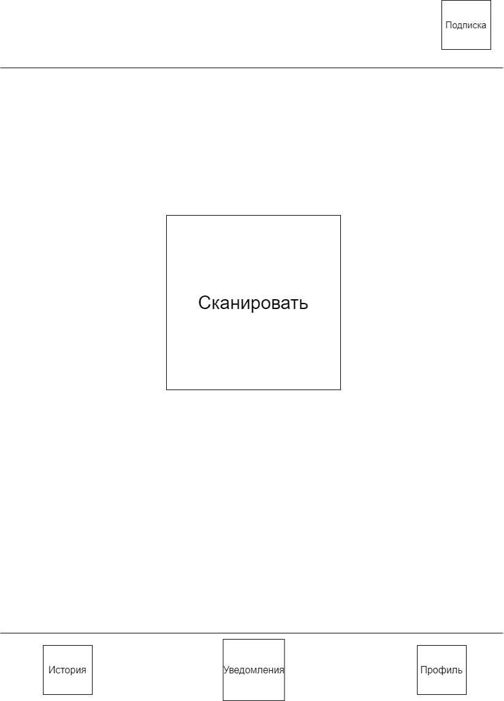
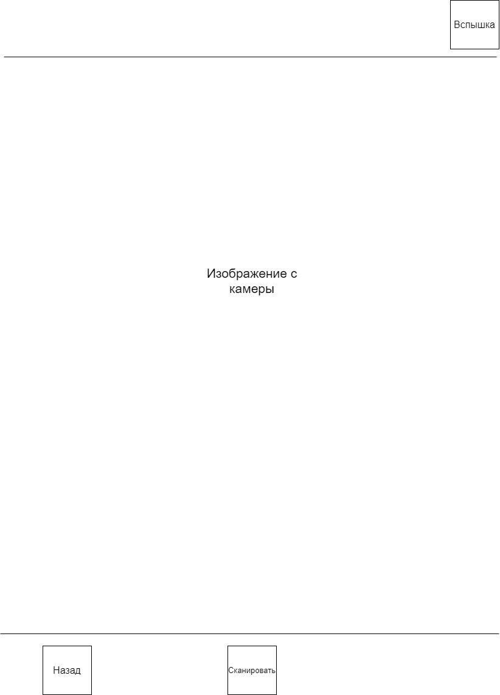
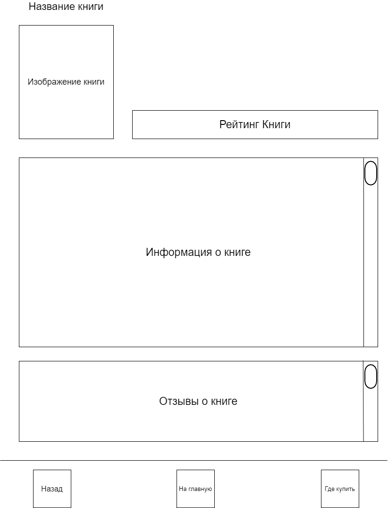
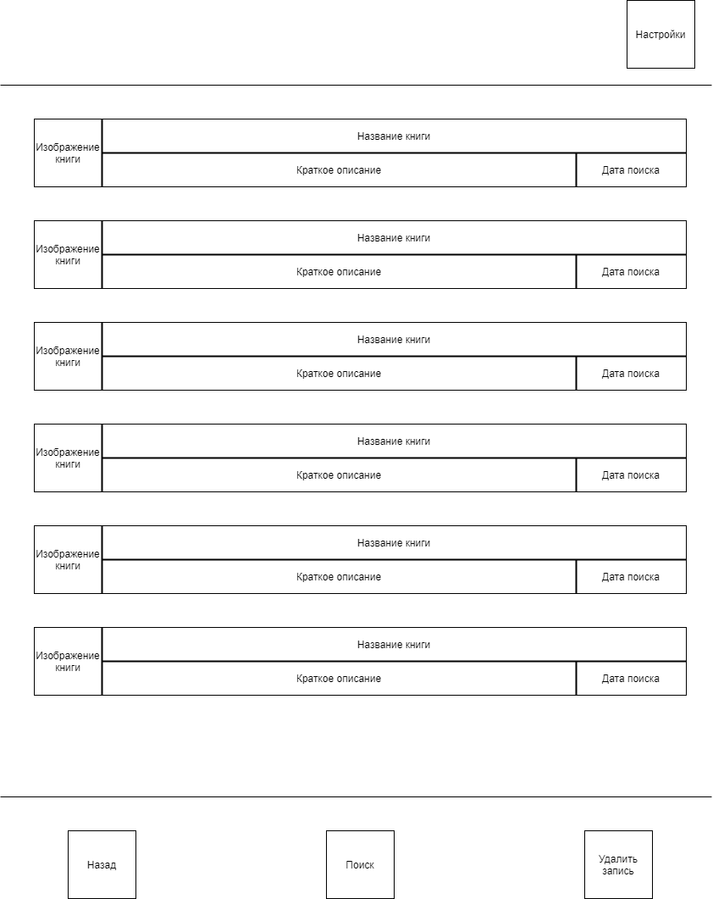

# Требования к проекту

## Введение

### 1. Введение

В этом документе описан функциональный и нефункциональные требования к приложению “BookFinder”. Данное приложение представляет собой мобильное приложения для поиска информации о книгах.

### 1.1. Бизнес требования
Чтобы пользователи могли получить информацию и отзывы о книге при выборе в магазине. Для людей, которые хотят выбрать книгу, часто встаёт вопрос: “А какую?” и они могут провести много времени при выборе у книжной полки. Приложение позволит упростить процесс выборы книги за счёт быстрого поиска с помощью камеры телефона.

### 1.2. Границы проекта
BookFinder будет выступать справочным материалом для пользователей, в ней нельзя будет купить книгу, лишь посмотреть информацию.

Программа будет бесплатной с платными функциями, пользователям не нужно будет регистрироваться так как программа будет использовать учётные записи Google Play и App Store. Для пользователей, которые приобрели платную подписку буду доступны дополнительные функции, такие как: поиск магазинов где можно приобрести книгу и сравнение цен.
### 1.3. Аналоги
Известным аналогом приложения с похожим функционалом является Vivino. Vivino — это приложение для оценки вина и площадка для его выбора с рекордным количеством пользователей. 

---
### 2. Требования пользователя

### 2.1. Интерфейс пользователя

Стартовое окно

Окно сканирования книги

Окно вывода информации о книге

Окно истории поиска

### 2.2. Классификация пользователей
#### 2.2.1. Типы пользователей
Обычный пользователь – имеет доступ к поиску книг, но видит рекламу после 2-3 книг, имеет доступ к истории поиска.

Платный пользователь – получает доступ к поиску без рекламы, получает более информативные данные о книгах, получает статистику цен на книгу и магазины где можно приобрести данную книгу, имеет доступ к статистике книг.
#### 2.2.2. Целевая аудитория
Программа подойдёт всем любителям книг
### 2.3. Предположения и зависимости
1. Приложение должно быть доступно на телефонах с операционными системами Android и IOS
2. Должен быть доступ к камере телефона
3. Должен быть доступ к аккаунту пользователей в Google Play и App Store

---
### 3. Системные требования
### 3.1. Функциональные требования
#### 3.1.1. Приложение от лиц обычных пользователей
* Пользователь при входе в программу получает уведомление о том что доступна платная подписка и перечисляются функции, которые она предоставляет.
* Если он не захочет покупать подписку, то он продолжает пользоваться приложением с ограничениями.
* При открытии истории сканирования пользователь видит последние 10 книг, которые он искал
#### 3.1.2. Приложение от лиц платных пользователей
* Доступ к программе без ограничений.
* При входе пользователь сразу попадает на главное окно без всяких уведомлений.
* При открытии статистики пользователь получает информацию о популярности книг и статистике по сканирование разных книг.
* При сканировании книги пользователь сразу получает описание книги, отзывы о ней, цены в разных магазинах и историю цен на данную книгу
* При открытии истории сканирования пользователь видит все свои сканирования
#### 3.1.3. Система поиска книг
Пользователь нажимает на кнопку для сканирования, открывается камера в приложении, далее пользователь фотографирует заинтересовавшую его книгу и после ожидает какой-то промежуток времени. После ожидания получает информацию о книге если программа смогла её найти.

При получении фотографии приложение с помощью нейронной сети сканирует фотографию, выделяет из неё книгу и ищет соответствия в базе данных, при обнаружении совпадений приложение выводит информацию о книге и отображает отзывы из интернета источников. Для платных пользователей так же предоставляет информацию о цене и магазинах в которых можно найти данную книгу.

Если программа не может распознать книгу, то появляется уведомление о том, что книга не найдена и просит пере фотографировать книгу ещё раз.

Если обычный пользователь просканировал книгу, то перед получением информации о книге будет отображена реклама.
### 3.2. Нефункциональные требования
#### 3.2.1. Требования к бд
В БД должны постоянно добавляться новые книги.
#### 3.2.2. Ограничения
1. Язык программирования Kotlin и Swift
2. UI пишется в Android studio и Swift UI
3. База данных PostgreSQL
4. Язык приложения русский и английский, в будущем добавление новых языков.
