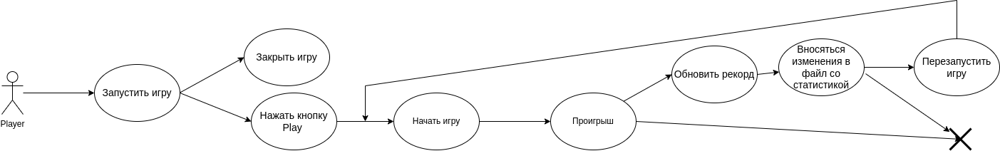
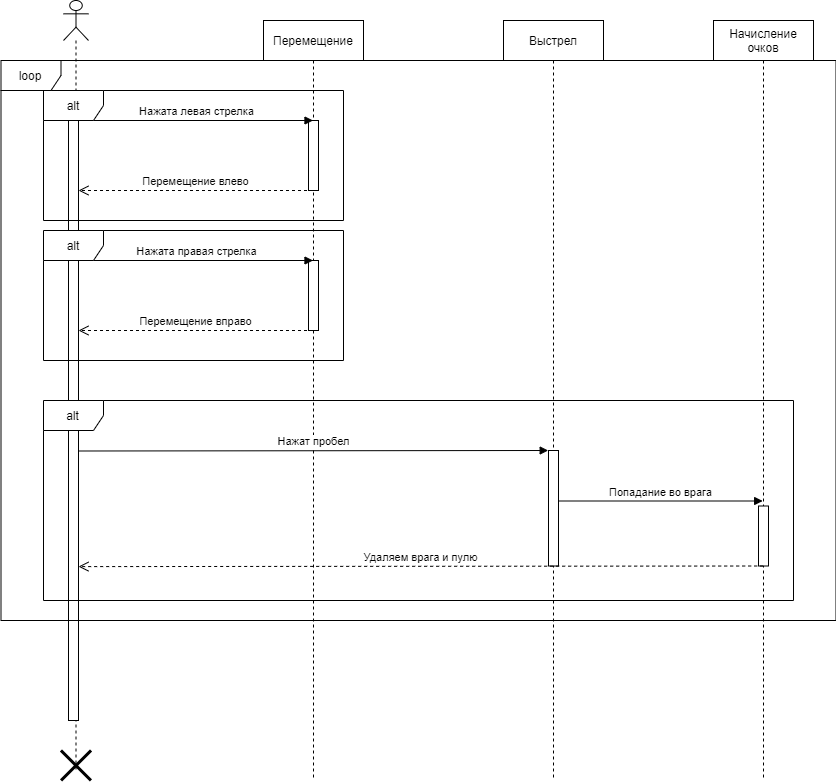
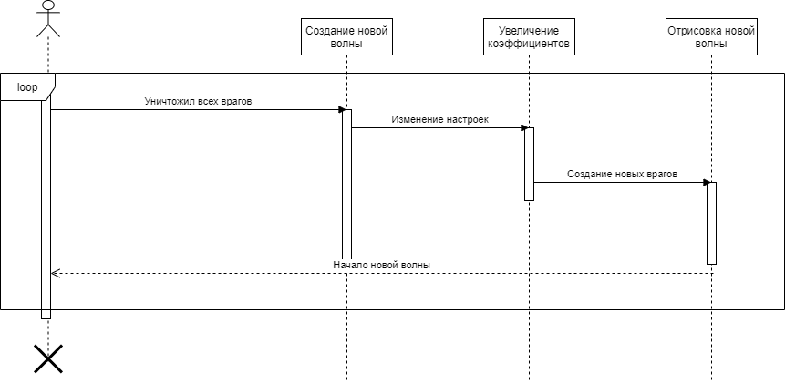
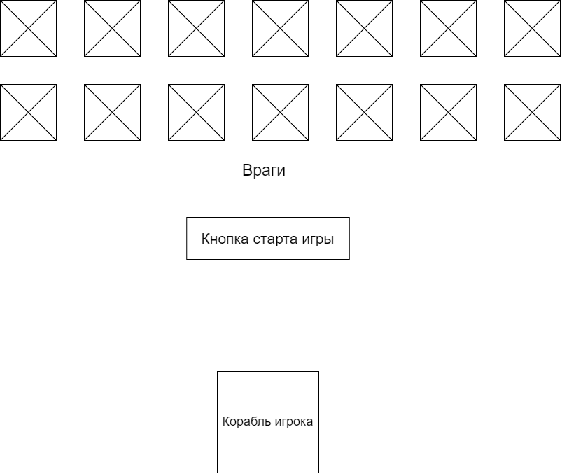

# SRS

## Введение

## 2 Диаграмма классов

## 3 Use case

## 4 Поток событий

1. Пользователь нажимает на кнопку Play
2. Пользователь начинает управлять кораблём используя клавиши левая стрелка, правая стрелка и пробел. Если была нажата левая стрелка, то корабль переместиться влево, если была нажата правая стрелка, то корабль переместиться вправо, если был нажат пробел, то произойдёт выстрел. Враги перемещаются горизонтально и постепенно снижаются.
3. Если корабль переместился до края экрана, то при нажатии клавиши, которая перемещает корабль в сторону этого же края экрана, корабль двигаться не будет.
4. Если пуля, выпущенная кораблём, достигла конца экрана, то она исчезает, если на экране одновременно находиться 3 пули, то блокируется возможность стрелять.
5. При попадании пулей по врагу, враг и пуля исчезают, а пользователь получает очки. Если пользователь уничтожил всех врагов на экране, то начнётся следующая волна с более сильными врагами.
6. При достижении врагами нижнего края экрана или столкновением с кораблём пользователя, пользователь теряет одну жизнь и начинает предыдущую волну заново. Если у пользователя закончились жизни, то он проиграл
7. При проигрыше можно закрыть игру, либо перезапустить и начать заново

## 5 Диаграммы активности

Старт игры

Перемещение

Выстрел

Конец игры

## 6 Диаграммы последовательностей

Перемещение и стрельба

Новая волна

Конец игры

## 7 Диаграммы состояния

Диаграмма состояния

Стартовое окно

Игровое окно

Окно проигрыша

