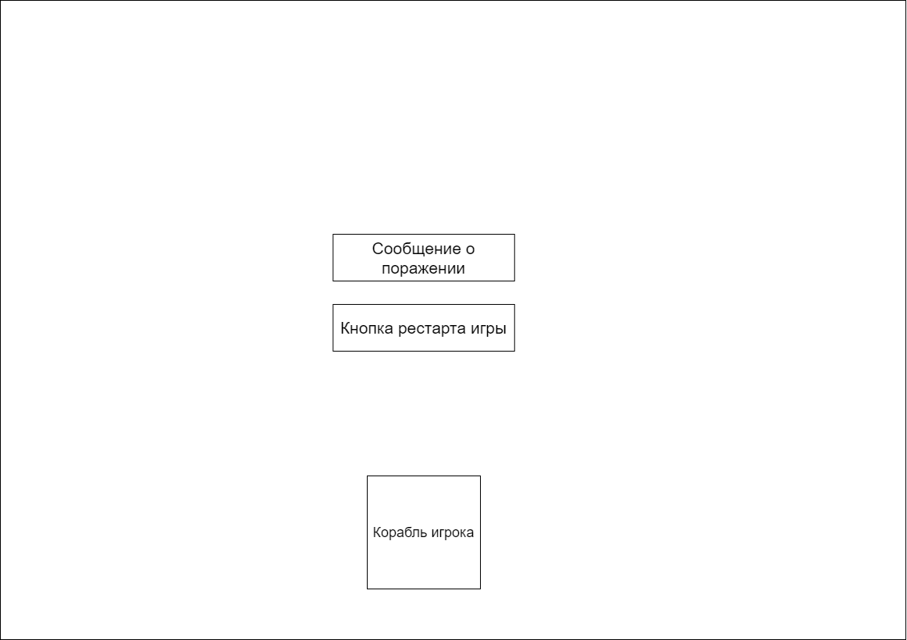

# Требования к проекту

## Введение

### 1. Введение

В этом документе описан функциональный и нефункциональные требования к приложению “alien invasion”. Данное приложение представляет собой игру в жанре “Shoot`em up"

### 1.1. Бизнес требования

Данное приложение выполняет развлекательную функцию. Сейчас очень распространены разные виды компьютерных игр и игры в жанре “Shoot`em up” одни из древнейших представителей данной отрасли. Сейчас они потеряли своё былое величие, но до сих пор есть тысячи представителей данного жанра игр. Данное приложение рассчитано для развлечения или отдыха от повседневных будней.

### 1.2. Границы проекта

Alien invasion будет представлять собой однопользовательскую игру в жанре Shoot`em up.

Программа будет полностью бесплатной и поддерживаться на всех популярных компьютерных операционных система: Windows, Linux, Mac OS.

### 1.3. Аналоги

Sprott, Thunder Force, Galaga. Существует множество игр в данном жанре и особенно много их было создано в 80-х – 90-х.

---
### 2. Требования пользователя

### 2.1. Интерфейс пользователя

Стартовое окно

Игровое окно

Окно проигрыша

### 2.2. Классификация пользователей
#### 2.2.1. Типы пользователей
Все пользователи будут в равных условиях и будут иметь одинаковый функционал.
#### 2.2.2. Целевая аудитория
Игра подойдёт всем любителям не замысловатых игр.
### 2.3. Предположения и зависимости
1. Приложение должно быть доступно на всех популярных компьютерных ОС: Linux, Windows, Mac OS.
2. Должен быть доступ к файлу с рекордами
3. Должен поддерживаться увеличение сложности

---
### 3. Системные требования
### 3.1. Функциональные требования
#### 3.1.1. Игровой процесс
После нажатия кнопки play игрок сможет управлять космическим кораблём, расположенным в нижней части экрана. Управление будет производиться путём нажатия стрелок влево и вправо на клавиатуре. Игрок сможет стрелять по противника при нажатии на пробел. Для усложнения игры у игрока будет ограничение по выстрелам: одновременно на экране сможет находиться три пули. Враги будут располагаться в центральной и верхней части экрана. Враги будут располагаться в несколько рядов по 8 кораблей. Враги перемещаються поочерёдно влевую и правую сторону, при столкновении с краем экрана линия врагов меняет своё направление движения и опускаються на одну линию вниз. В верхнем правом углу будет располагаться счёт за данную игру. Под счётом будет отображаться номер волны. В верхней части экрана будет располагаться рекордный счёт, который был получен за всё время. В верхнем левом углу будет располагаться количество жизней игрока.

Основная логика игры состоит в том, что игрок с помощью пуль убивает врагов, которые в свою очередь спускаются вниз, и получает очки за каждого убитого противника. При уничтожении всех противников на экране появляются новые враги за убийство которых дают больше очков, но враги становиться быстрее. При достижении нижнего края экрана или соприкосновения корабля игрока с врагом игрок будет терять одну жизнь, при отсутствии жизней игрок проигрывает.

Враги спускаються с заданной в настройках скоростью и ускаряються на новой волне.
### 3.2. Нефункциональные требования
#### 3.2.1. Визуальный стиль
Стиль должен быть выполнен в космическом стиле.
#### 3.2.2. Ограничения
1. Язык программирования Python
2. UI пишется с помощью библиотеки pygames
3. Приложение должно быть доступно на всех популярных компьютерных ОС: Linux, Windows, Mac OS.
4. Язык приложения английский, в будущем добавление новых языков.
